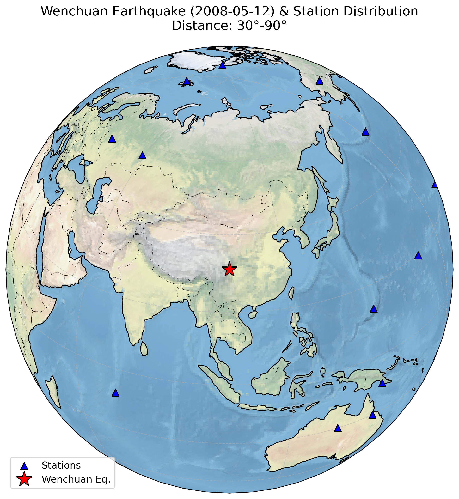
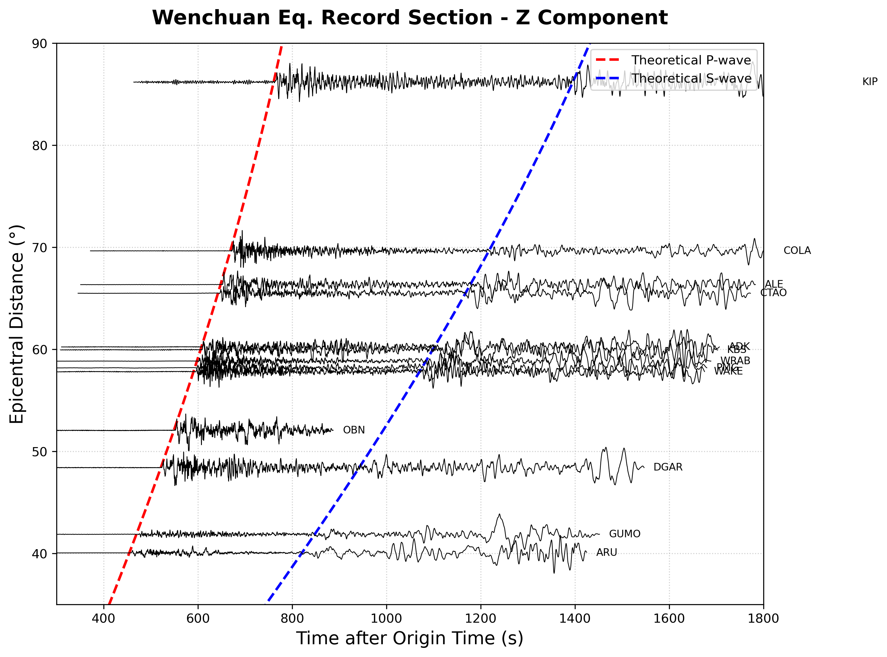
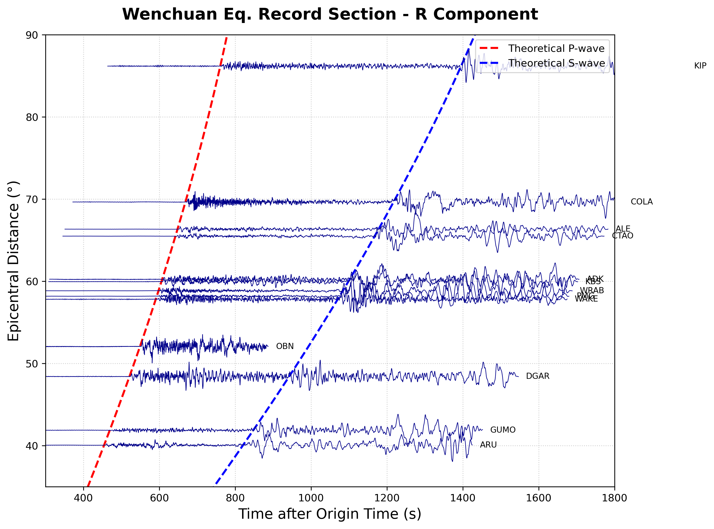
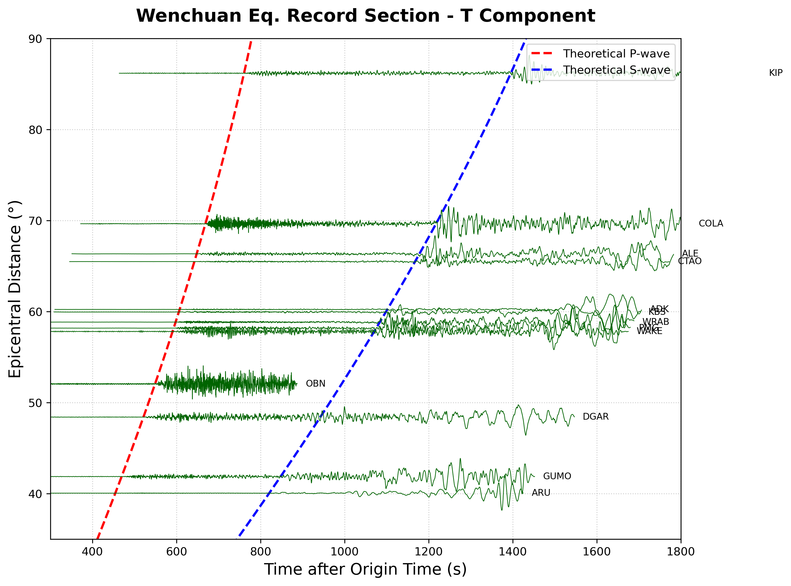

# Homework 3: 汶川地震波形数据处理与分析报告

> **姓名:** 杜鑫宇 &nbsp;&nbsp;&nbsp; **学号:** 231830104 &nbsp;&nbsp;&nbsp; **日期:** 2026/03/20
> **开源代码仓库:** [GitHub - solid_physics/HW3](https://github.com/Starfie1d1272/solid_physics/tree/main/HW3)

## 1. 数据获取与台站筛选

首先获取 2008 年 5 月 12 日汶川大地震 ($M_w 7.9$) 的地震波形数据。为了确保数据的可靠性与后续坐标系旋转的顺利进行，本次作业借助 PyWEED 软件进行了条件筛选。

### 1.1 筛选参数设定
*   **震中距范围:** 限制在 30° ~ 90° 之间。此范围属于远震窗口，地震波射线主要穿过相对均匀的下地幔，有效避开了上地幔复杂结构的“三叉波”干扰以及地核的 P 波影区，从而确保 P 波初动清晰可辨。
*   **通道要求:** 仅筛选包含完整三分量 (`BHZ`, `BHN`, `BHE`) 的宽频带台站，剔除了带有未知方位的水平分量 (`BH1`, `BH2`) 的台站，以满足后续 $NE \rightarrow RT$ 坐标系旋转的要求。
*   **时间窗设定:** 截取时间段设置为理论 P 波到达前 300 秒至理论 S 波到达后 600 秒。保留 300 秒的前置噪声时间有助于后续评估地震波的信噪比。

### 1.2 台站分布
为了满足“分布尽量均匀”的要求，在各大洲挑选了分布在不同方位角的 GSN 顶级台网 (如 `IU`, `II`) 台站。在下载前对波形进行了人工肉眼质控：
1.  **剔除异常台站：** 剔除了如 `RAYN` 等存在数据丢失的台站，以及基线极度不稳定或噪声过大的台站。
2.  **保留高质量台站：** 最终精选了 13 个具有较高质量波形的台站（如俄罗斯的 `ARU`, `OBN`，加拿大的 `ALE`，澳洲的 `WRAB` 等）。这些台站的 P 波初动相对清晰，能够较好地展现纵波与横波的物理特征。

*所有波形数据均已勾选 `Use event time` 以对齐发震时间，并保存为 SAC 格式至本地 `data/` 目录。*

## 2. 数据预处理与坐标系旋转

使用 Python 的 ObsPy 库对下载的 39 条波形数据（13个台站的三分量）进行批量处理。首先通过 FDSN 客户端下载了对应台站的仪器响应文件 (Inventory)。具体处理流程如下：

1. **基础清洗：** 应用 `detrend('linear')` 和 `detrend('constant')` 消除仪器基线漂移与均值偏移，并利用 `merge()` 拼接可能存在的数据断片。
2. **去除仪器响应：** 调用 `remove_response()` 将原始记录的数字电信号转换为真实的地表运动速度 (m/s)。为防止低频和高频噪声在转换时被放大，设置了带通滤波参数 `pre_filt=(1.0/180, 1.0/150, 4, 5)`。
3. **坐标系旋转：** 根据震源（汶川）和各个台站的经纬度，计算震中距、方位角和反方位角。随后将默认的水平面正北(N)和正东(E)分量，沿着反方位角旋转为径向(R)和切向(T)分量。此步骤主要是为了分离 P/SV 波与 SH 波的能量。
4. **写入头段信息：** 将计算得到的震中距（度）和震源经纬度等信息更新至 SAC 头段中，为绘制波形剖面图建立距离坐标基准。

## 3. 绘图与结果分析

基于处理后的 Z、R、T 三分量速度数据，使用 matplotlib 和 cartopy 库绘制了以下四张图件。

### 3.1 台站与震源空间分布
利用 Cartopy 库绘制了以汶川地震震中为中心的正射投影地图（见图 1）。图中红色五角星代表震源位置，蓝色三角形代表筛选出的 13 个远震台站。可以看出，台站在 30°~90° 的环形区域内分布相对均匀，实现了较好的方位角覆盖。

<b>图 1. 汶川地震震源及筛选台站的空间分布图</b>

### 3.2 理论走时与三分量波形剖面
利用 `obspy.taup` 模块和 `iasp91` 一维地球速度模型，设定震源深度为 15 km，计算了 P 波和 S 波的理论到达时间。将波形时间轴统一对齐至发震时刻，并按震中距自下而上排列，绘制了 Z、R、T 三个分量的波形剖面图，为便于观察对波形振幅进行了归一化处理。

<b>图 2. Z 分量波形剖面图</b>

<b>图 3. R 分量波形剖面图</b>

<b>图 4. T 分量波形剖面图</b>

**数据特征与物理分析：**

1. **P 波的能量分布：** 在 Z 分量（垂直方向）剖面中，可以观察到在理论 P 波到达时间（红色虚线）处，大部分台站均出现了清晰的初动起伏。这是因为 P 波作为纵波，在远震距离上以较陡的角度到达地表，其质点振动方向与传播方向一致，因此能量主要体现在垂直分量上。
2. **S 波的能量分布：** 对比可见，水平分量（R 和 T 分量）在 P 波到达时的振幅相对微弱。而在理论 S 波到达时间（蓝色虚线）之后，水平分量的波形呈现出显著的宽幅震荡。这是符合波的传播规律的，S 波作为横波，其剪切运动的能量绝大部分分布在水平面上。
3. **走时的一致性：** 在震中距 58°~60° 附近，包含了来自不同方向的多个台站（如 KBS、ADK、WRAB、PMG 等）。尽管它们所处的地理方位角差异很大，但 P 波和 S 波的实际到达时间与一维理论模型（红蓝虚线）高度吻合。这直观地反映了地球内部大尺度速度结构在同一深度层面上近似球对称的物理性质。