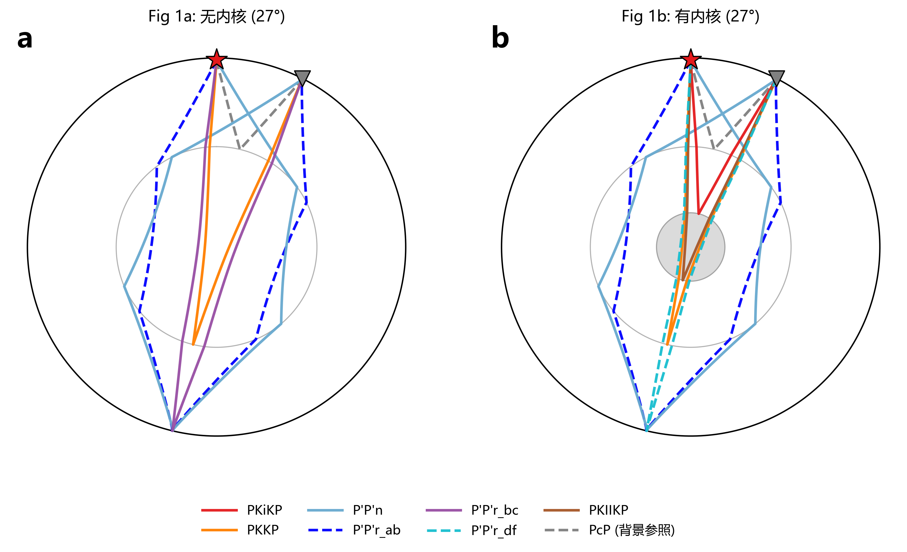
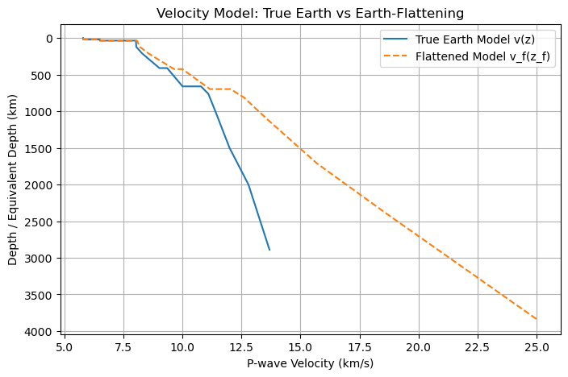
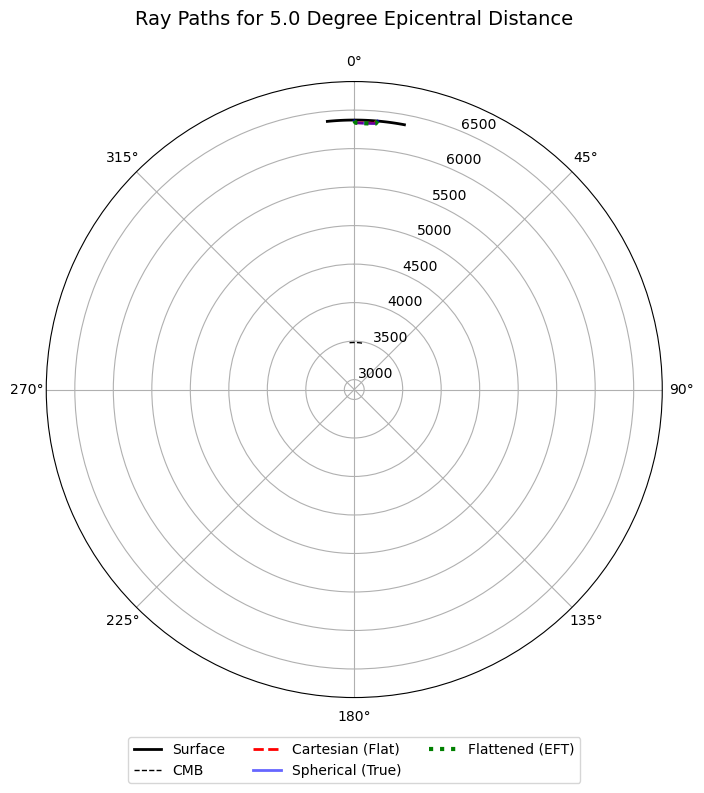
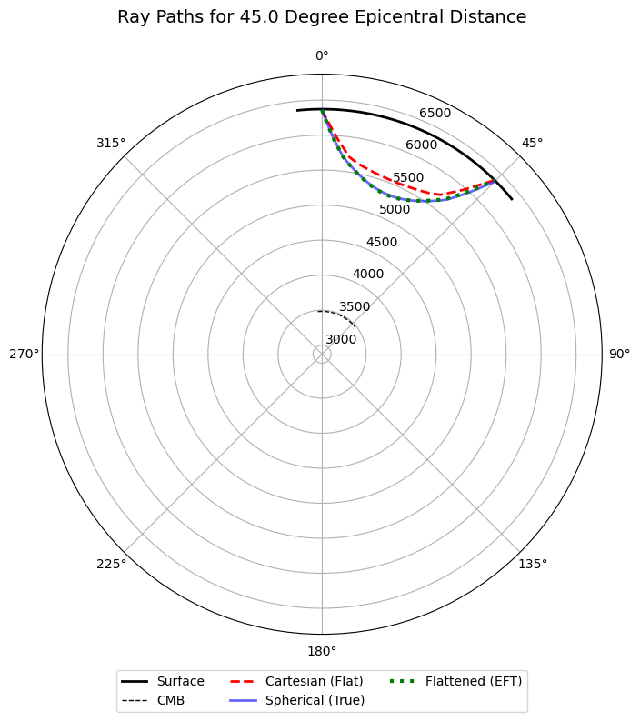

# Homework 4: 火星内核射线追踪与震相走时对比报告

> **姓名:** 杜鑫宇  
> **学号:** 231830104  
> **日期:** 2026/04/10
> **课程:** 行星固体物理

---

## 一、 题目一：火星内核射线追踪与震相对比

### 1.1 数据与参数设置
- **参考文献**: Stahler et al., Nature (2025)
- **计算工具**: Python 3.x, ObsPy (`obspy.taup`), NumPy, Matplotlib
- **基础参数**: 火星半径 3389 km，震源深度 33 km，对比震中距 27°。
- **模型设置**: 
  - 模型 A：无固态内核（液态外核延伸至中心）
  - 模型 B：有固态内核（ICB 深度约 2776.5 km）

通过编写 `.nd` 速度模型文件并编译为 TauP 可读的 `.npz` 格式，调用 `TauPyModel.get_ray_paths()` 计算指定震相的射线路径，并在极坐标下进行可视化。

### 1.2 射线路径与走时结果
在 27° 震中距下，两套模型的射线路径对比图见图 1（对应文献 Fig1a/Fig1b）。

*(图1：震中距 27° 下无内核模型与有内核模型的射线路径对比)*

通过提取 27° 下的可见震相（不含 PcP），两模型的走时与射线参数对比汇总如下：

**表 1：无固态内核模型可见震相表（震中距 27°）**

| 序号 | 规范震相名(TauP) | 本文震相名 | 走时(s) | 射线参数(s/deg) | 出射角(°) | 入射角(°) |
| ---- | ---------- | ---------- | ------: | --------------: | --------: | --------: |
| 0    | PKPPKP     | P'P'n      | 2492.16 |          4.1856 |     16.61 |     16.44 |
| 1    | PKPPKP     | P'P'r_ab   | 2270.88 |          3.8848 |     15.38 |     15.23 |
| 2    | PKPPKP     | P'P'r_bc   | 2232.93 |          1.0271 |      4.02 |      3.98 |
| 3    | PKKP       | PKKP       | 1784.96 |          0.6417 |      2.51 |      2.49 |

**表 2：有固态内核模型可见震相表（震中距 27°）**

| 序号 | 规范震相名(TauP) | 本文震相名 | 走时(s) | 射线参数(s/deg) | 出射角(°) | 入射角(°) |
| ---- | ---------- | ---------- | ------: | --------------: | --------: | --------: |
| 0    | PKPPKP     | P'P'n      | 2492.16 |          4.1856 |     16.61 |     16.44 |
| 1    | PKPPKP     | P'P'r_ab   | 2270.88 |          3.8848 |     15.38 |     15.23 |
| 2    | PKIKPPKIKP | P'P'r_df   | 2143.59 |          0.4429 |      1.73 |      1.72 |
| 3    | PKIIKP     | PKIIKP     | 1237.09 |          0.2413 |      0.94 |      0.94 |
| 4    | PKIKKIKP   | PKKP       | 1692.58 |          0.3673 |      1.44 |      1.42 |
| 5    | PKiKP      | PKiKP      |  908.19 |          0.5347 |      2.09 |      2.07 |

**结果对比分析：**
1. **共有震相**：`P'P'n`, `P'P'r_ab`, `PKKP` 在两模型中均出现。
2. **差异震相**：无核模型特有 `P'P'r_bc` 分支；有核模型特有 `P'P'r_df`, `PKIIKP`, `PKiKP`。
3. **走时提前效应**：
   - 对于 `PKKP`，有核模型走时（1692.58 s）比无核模型（1784.96 s）提前约 92.38 s。
   - 无核模型中的 `PKPPKP(bc)` 分支可对应为有核模型中的 `PKIKPPKIKP(df)` 分支，后者走时提前约 89.34 s。
   - 有核模型中出现了最早到时的深部核相 `PKiKP`（约 908 s），这表明固态内核显著改变了深部射线的传播路径并增加了新的可见震相。

### 1.3 讨论与误差分析

**与文献结果的差异来源**
本作业主图在结构与图例层面已基本还原文献 Fig1a/1b 的特征，但数值细节上存在一定差异。这主要归因于：
1. 本次计算使用的是简化的教学参数化 1D 模型，而非文献中经过复杂反演的完整模型，外核与内核的速度梯度及分层细节被大幅简化。
2. TauP 的默认相位搜索在特定距离窗口内受限，文献中部分高阶复杂相在简化模型中表现出的可见性与真实情况有所偏差。

**计算与可视化过程中的技术细节**
在实现过程中，为保证结果与文献对齐，主要解决了以下几个技术问题：
- **模型圈层解析问题**：初期无内核模型在 27° 下核区震相缺失。排查发现 TauP 对 `.nd` 格式的圈层标签有严格要求，补充完整的 `outer-core` 和 `inner-core` 标签后 CMB/ICB 解析恢复正常。
- **复杂震相追踪**：TauP 默认的广度搜索难以捕获深部微弱震相。解决方案是在相位池中显式指定高阶复杂相名称（如 `PKIKKIKP`, `PKIKPPKIKP`）。
- **可视化投影畸变**：直接使用 matplotlib 的 `polar=True` 会导致射线轨迹在极坐标系下出现非物理的“鼓包”插值畸变。最终改为获取原始 `(r, theta)` 数据并手动转换为笛卡尔坐标（$x=r \sin\theta, y=r \cos\theta$）进行精确绘制。
- **重叠遮挡处理**：对于 `end_deg > 180` 的优弧分支，采用了镜像展示的方法，有效避免了优劣弧在同侧叠加导致的视觉混淆，使其排版更接近文献版式。

---

## 二、 题目二：直达 P 波射线路径与走时计算及展平变换验证

### 2.1 实验背景与方法
本部分基于真实地球的 IASP91 速度模型，采用打靶法计算震源深度 10 km 时的直达 P 波射线。
实验对比了以下三种算法：
1. 直角坐标 Snell 定律（忽略地球曲率的平面假设）
2. 球坐标 Snell 定律（真实地球曲率）
3. 展平变换后直角坐标 Snell 定律（Earth-Flattening Transformation, EFT）

展平变换通过映射，将球坐标下的半径 $r$ 和速度 $v$ 转换为直角坐标下的等效深度 $z_f$ 和等效速度 $v_f$。变换前后的速度模型对比见图 2-1。

*(图2-1：真实地球 IASP91 模型与展平变换等效模型的对比)*

### 2.2 计算结果对比

#### 1. 近震情况（震中距 5°）
设定震中距为 5°（地表弧长约 550 km），射线路径结果如图 2-2 所示。

*(图2-2：震中距 5° 下三种算法的射线路径对比)*

- **走时分析**：展平变换法与球坐标法的走时残差仅为 **0.0002 秒**；直角坐标平地模型与球坐标法的走时残差也仅为 **0.3766 秒**。
- **路径特征**：三条射线在视觉上几乎完全重合。
- **推论**：在 5° 的近震条件下，地球曲率影响极小。局部区域可近似为平面，即使不考虑曲率的直角坐标法也能得出较高精度的近似解。

#### 2. 远震情况（震中距 45°）
设定震中距为 45°（地表弧长约 5000 km），计算结果如图 2-3 所示。

*(图2-3：震中距 45° 下三种算法的射线路径对比)*

- **走时分析**：展平变换法与球坐标法高度一致（残差 **0.1296 秒**，主要为数值积分误差）；但未经变换的直角坐标法与球坐标法的走时残差急剧放大至 **47.8556 秒**。
- **路径特征**：展平变换（绿色虚线）与球坐标（蓝色实线）路径完美重合。而纯直角坐标计算的路径（红色虚线）发生严重几何偏离，其必须向下“潜入”极深的地幔区域才能达到目标水平距离。
- **推论**：在远震距离下，地球曲率效应占据主导地位，“平地假设”彻底失效。

---

## 三、 总结

1. **火星内核结构探测**：成功完成了两套火星内核结构模型的 TauP 射线追踪。结果有力支持了“固态内核的存在会改变深部射线传播路径并催生新的可见震相（如PKiKP等）”的结论，且内核会导致对应穿透相的走时显著提前。
2. **展平变换的有效性与必要性**：不论是在 5° 还是 45° 震中距下，展平变换法与球坐标法的结果始终保持一致。这验证了 EFT 在物理与数学上的等价性：通过对模型进行展平映射，可以在直角坐标系下安全、精确地计算球体中的射线路径。
3. **平面假设的局限性**：直接使用直角坐标 Snell 定律而不作展平变换，仅适用于极小尺度的近地表研究。在大尺度远震分析中，必须引入球坐标计算或展平变换，否则将产生数十秒级别的原理性走时误差及巨大的路径偏离。

---

## 附录

### A1. 代码运行说明
- **题目一**：依赖环境设置完毕后，运行 `HW4_text1.ipynb`，按单元顺序执行，最后将输出本文所用的射线图及震相对比表。
- **题目二**：运行 `HW4_text2.ipynb`，按单元顺序执行可复现模型对比图及不同震中距下的误差分析结果。

### A2. 火星 TauP 模型参数摘要 (参考数据)

| 模型版本 | 圈层 | 深度范围 (km) | Vp (km/s) | Vs (km/s) | 密度 (g/cm³) | 备注 |
| :--- | :--- | :--- | :--- | :--- | :--- | :--- |
| **有固态内核** | 地壳 | 0.0-50.0 | 4.00 | 2.20 | 3.00 | 浅层定值 |
| (ic) | 地幔 | 50.0-1590.5 | 6.80-7.50 | 3.90-4.30 | 3.30-3.60 | 正梯度 |
| | 外核 | 1590.5-2776.5 | 4.90-5.50 | 0.00 | 6.00-6.50 | 液态外核 |
| | 内核 | 2776.5-3389.5 | 7.15-7.30 | 3.50-3.60 | 8.00-8.20 | 固态内核 |
| **无固态内核** | 地壳 | 0.0-50.0 | 4.00 | 2.20 | 3.00 | 浅层定值 |
| (no_ic) | 地幔 | 50.0-1590.5 | 6.80-7.50 | 3.90-4.30 | 3.30-3.60 | 正梯度 |
| | 外核 | 1590.5-3389.5 | 4.90-5.80 | 0.00 | 6.00-6.80 | 延伸至球心 |

*(注：完整逐行模型参数详见随附的 `HW4/models/mars_ic.nd` 与 `HW4/models/mars_no_ic.nd` 文件)*