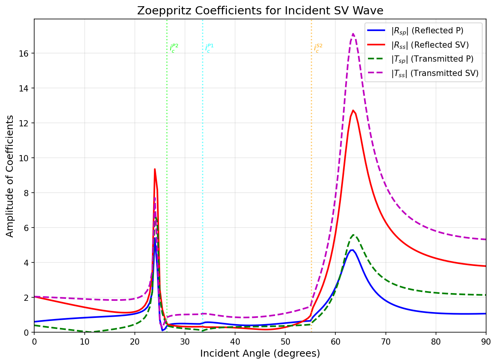
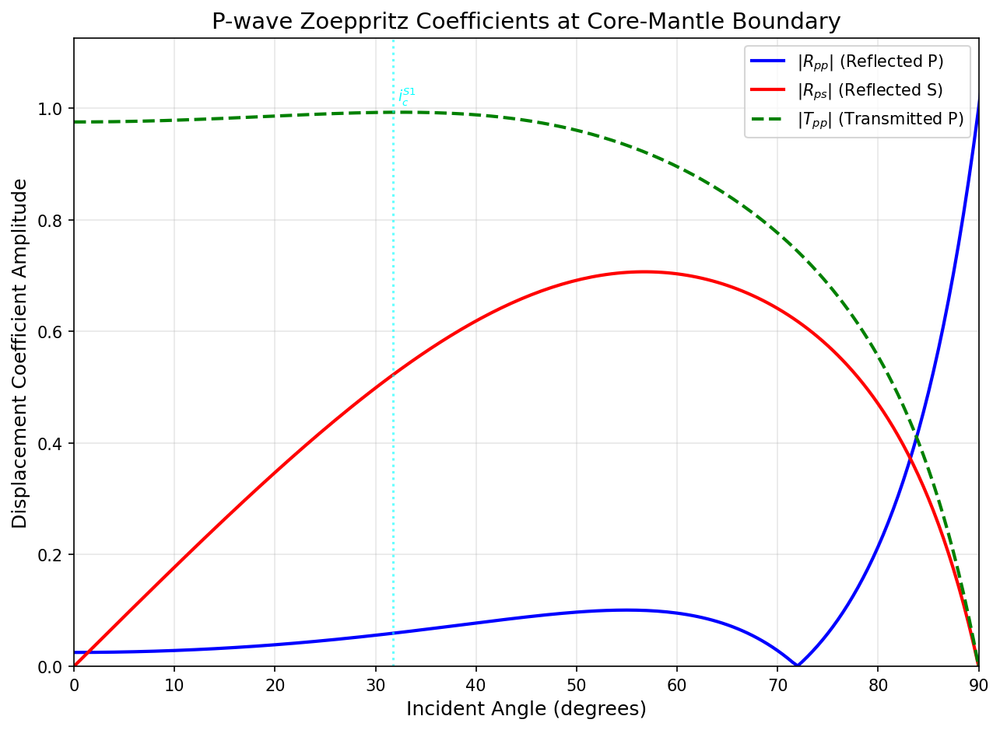

# Homework 5: 固体-固体界面 Zoeppritz 方程与 SV 波斜入射问题

> **姓名:** 杜鑫宇  
> **学号:** 231830104  
> **日期:** 2026/04/27  
> **课程:** 行星固体物理

---

## 第一题：SV 波斜入射固体-固体平面界面的 Zoeppritz 系数

### 问题重述

考虑一个固体-固体平坦界面（设界面为 $z=0$ 平面），上下两半空间均为各向同性均匀弹性介质。一道 SV 波（横波，质点振动方向在入射面内）以角度 $i$ 从介质 1 斜入射至界面上。在界面上，SV 波会发生波型转换，产生以下四类次级波：

- **反射 P 波**（mode-converted），振幅记为 $R_{sp}$
- **反射 SV 波**（同模式反射），振幅记为 $R_{ss}$
- **透射 P 波**（mode-converted），振幅记为 $T_{sp}$
- **透射 SV 波**（同模式透射），振幅记为 $T_{ss}$

请根据弹性波动理论，推导出上述四个系数的求解方程（Zoeppritz 方程组）。

---

### 第一步：Snell 定律与射线参数

设入射 SV 波角度为 $i$（即 $\theta_{S1}$）。由于界面两侧介质的水平慢度必须连续，定义射线参数 $p$ 如下：

$$ p = \frac{\sin i}{\beta_1} = \frac{\sin \theta_{P1}}{\alpha_1} = \frac{\sin \theta_{P2}}{\alpha_2} = \frac{\sin \theta_{S2}}{\beta_2} $$

其中：
- $\alpha_1, \beta_1$ — 介质 1 的 P 波与 S 波速度
- $\alpha_2, \beta_2$ — 介质 2 的 P 波与 S 波速度
- $\theta_{P1}$ — 反射 P 波角度
- $\theta_{P2}$ — 透射 P 波角度
- $\theta_{S2}$ — 透射 SV 波角度

由上式可显式表示出各次级波的角度：

$$ \theta_{P1} = \arcsin\!\left(\frac{\alpha_1}{\beta_1} \sin i\right), \quad
\theta_{P2} = \arcsin\!\left(\frac{\alpha_2}{\beta_1} \sin i\right), \quad
\theta_{S2} = \arcsin\!\left(\frac{\beta_2}{\beta_1} \sin i\right) $$

当入射角 $i$ 超过某类波的临界角时，对应角度成为复数，反射/透射系数变为复数（表示全反射与相位偏移）。

---

### 第二步：物理边界条件

在固体-固体理想接触界面（$z=0$）上，必须满足以下四个连续性条件：

1. **法向位移连续**（$w_1 = w_2$）：上下介质在垂直于界面方向不能脱开
2. **切向位移连续**（$u_1 = u_2$）：上下介质在平行于界面方向不能滑动
3. **法向应力连续**（$\sigma_{zz1} = \sigma_{zz2}$）：垂直方向的挤压/拉伸力平衡
4. **切向应力连续**（$\sigma_{xz1} = \sigma_{xz2}$）：水平方向的剪切力平衡

---

### 第三步：Zoeppritz 方程组的建立

将入射 SV 波、反射 P 波、反射 SV 波、透射 P 波、透射 SV 波的位移场和应力场表达式分别代入上述四个边界条件，整理后得到一个 $4 \times 4$ 线性方程组 $\mathbf{M} \mathbf{x} = \mathbf{b}$。

未知数向量为：

$$ \mathbf{x} = \begin{bmatrix} R_{sp} \\ R_{ss} \\ T_{sp} \\ T_{ss} \end{bmatrix} $$

按照 Aki & Richards (2002) 的经典形式，系数矩阵 $\mathbf{M}$ 与右端项 $\mathbf{b}$ 的具体表达式如下：

#### 位移连续条件

**法向位移（第 1 行）：**

$$ -\sin\theta_{P1} \cdot R_{sp} - \cos i \cdot R_{ss} - \sin\theta_{P2} \cdot T_{sp} + \cos\theta_{S2} \cdot T_{ss} = \sin i $$

**切向位移（第 2 行）：**

$$ \cos\theta_{P1} \cdot R_{sp} - \sin i \cdot R_{ss} + \cos\theta_{P2} \cdot T_{sp} + \sin\theta_{S2} \cdot T_{ss} = \cos i $$

#### 应力连续条件

**法向应力 $\sigma_{zz}$（第 3 行）：**

$$ 2\rho_1\beta_1^2 p\cos\theta_{P1} \cdot R_{sp} + \rho_1\beta_1(1-2\beta_1^2 p^2) \cdot R_{ss} + 2\rho_2\beta_2^2 p\cos\theta_{P2} \cdot T_{sp} - \rho_2\beta_2(1-2\beta_2^2 p^2) \cdot T_{ss} = -\rho_1\beta_1(1-2\beta_1^2 p^2) $$

**切向应力 $\sigma_{xz}$（第 4 行）：**

$$ -\rho_1\alpha_1(1-2\beta_1^2 p^2) \cdot R_{sp} + 2\rho_1\beta_1^2 p\cos i \cdot R_{ss} + \rho_2\alpha_2(1-2\beta_2^2 p^2) \cdot T_{sp} + 2\rho_2\beta_2^2 p\cos\theta_{S2} \cdot T_{ss} = 2\rho_1\beta_1^2 p\cos i $$

> 注：上述方程中 $p$ 为第一步定义的射线参数，$\rho_1, \rho_2$ 分别为介质 1、2 的密度。此形式严格遵循 Aki & Richards (2002) 的约定，与常见的 P 波入射形式在符号和项的组合上存在差异。

---

### 第四步：求解方法

将上述四个方程写成矩阵形式 $\mathbf{M}\mathbf{x} = \mathbf{b}$ 后，可通过以下方法求解：

1. **克莱姆法则（Cramer's Rule）**：获得各系数的解析表达式（代数式较为冗长）
2. **矩阵求逆**：$\mathbf{x} = \mathbf{M}^{-1}\mathbf{b}$，适用于数值计算
3. **数值线性代数求解**：如高斯消元、LU 分解等

在实际应用中，当给定具体的介质参数和入射角度后，可直接采用数值方法求解。若需要对系数行为进行快速定性分析，也可使用 Zoeppritz 方程的近似形式（如 Aki-Richards 近似、Shuey 近似等）进行简化。

---

### 第五步：数值模拟验证

为了直观展示 Zoeppritz 系数的角度依赖特征，选取一组具有地球物理意义的参数进行数值求解：

| 参数 | 介质 1（浅层地壳） | 介质 2（深层地壳） |
| :-- | :--: | :--: |
| 密度 $\rho$ (g/cm³) | 2.7 | 3.3 |
| P 波速度 $\alpha$ (km/s) | 5.8 | 7.2 |
| S 波速度 $\beta$ (km/s) | 3.2 | 3.9 |

计算入射角范围 $0^\circ$ 到 $90^\circ$，步长 $0.5^\circ$，得到四个 Zoeppritz 系数的振幅随入射角的变化曲线（图 1）。


*(图 1：SV 波入射时四个 Zoeppritz 系数的振幅—角度关系曲线。垂直虚线标示三类临界角位置。)*

#### 临界角分析

由 Snell 定律可确定三个临界角：

- **反射 P 波临界角**：$i_c^{P1} = \arcsin(\beta_1/\alpha_1) \approx 33.5^\circ$
- **透射 P 波临界角**：$i_c^{P2} = \arcsin(\beta_1/\alpha_2) \approx 26.4^\circ$
- **透射 SV 波临界角**：$i_c^{S2} = \arcsin(\beta_1/\beta_2) \approx 55.1^\circ$

#### 结果讨论

从图 1 中可以观察到以下物理特征：

1. **小角度区域（$0^\circ < i < 26.4^\circ$）**：所有系数均为实数，波型转换正常发生。透射 P 波系数 $|T_{sp}|$ 在 $i \to 0^\circ$ 时趋于一个有限小值，这与 SV 波在垂直入射（$i=0^\circ$）时纵波激发效率较低的特征相符。

2. **第一临界角（$i = 26.4^\circ$）**：透射 P 波（$T_{sp}$）率先超临界，振幅出现剧烈跳变。此处 $T_{sp}$ 变为复数，$|T_{sp}|$ 迅速衰减，而能量重新分配到反射波和透射 SV 波中。

3. **第二临界角（$i = 33.5^\circ$）**：反射 P 波（$R_{sp}$）达到临界，其振幅同样呈现复杂弯曲。

4. **大角度区域（$i > 55.1^\circ$）**：所有转换波均处于超临界状态，$|R_{ss}|$ 逐渐趋于 1（全反射），$|T_{ss}|$ 稳定在非零但较小的水平。能量主要以反射 SV 波形式回到介质 1 中。

5. **反射 SV 波 $|R_{ss}|$** 在大部分角度范围内占主导地位，体现了 SV 波入射时同模式反射为主要能量通道的基本物理图像。

---

### 总结

本题目完成了以下工作：

1. **理论推导**：从 Snell 定律出发，建立 SV 波斜入射固体-固体界面的四个物理边界条件，严格导出了 Zoeppritz 方程组的 Aki & Richards (2002) 标准矩阵形式。该形式适用于任意入射角（包括超临界后的复数域计算）。

2. **数值验证**：采用数值矩阵求解方法，在典型地壳参数下计算了 $0^\circ$ 至 $90^\circ$ 范围内四个 Zoeppritz 系数的振幅特征，清晰识别了三类临界角及其对各系数的物理影响。

3. **物理图像**：结果明确了 SV 波入射与 P 波入射的关键差异——SV 波在近垂直入射时 P 波转换效率较低，且存在三个临界角而非两个，反映了横波入射时更丰富的波型转换机制。

---

## 附录

### A1. 代码运行说明

- 核心计算位于 `HW5_Q1_Zoeppritz.ipynb`，按单元顺序执行即可
- Cell 1：导入依赖与参数定义
- Cell 2：Zoeppritz 求解函数（支持复数角度，基于 `numpy.lib.scimath`）
- Cell 3：批量计算与可视化绘图

### A2. 依赖环境

```bash
cd ~/GitHub/solid_physics
mamba run -n solid_physics jupyter notebook HW5/HW5_Q1_Zoeppritz.ipynb
```

所需依赖：`numpy`, `matplotlib`

---

## 第二题：P 波斜入射核幔边界（固体-流体界面）的 Zoeppritz 系数

### 问题重述

考虑地球核幔边界（CMB）——一个固体（下地幔）与流体（外地核）的理想平面界面。一道 P 波从下地幔以角度 $i$ 斜入射至界面上，发生以下波型转换：

- **反射 P 波**（同模式反射），振幅记为 $R_{pp}$
- **反射 S 波**（mode-converted），振幅记为 $R_{ps}$
- **透射 P 波**（透过界面进入流体），振幅记为 $T_{pp}$
- **透射 S 波**：**不存在**（$T_{ps}=0$），因为流体无法传播剪切波

采用固体-流体界面的物理参数：

| 参数 | 介质 1（下地幔，固体） | 介质 2（外地核，流体） |
| :-- | :--: | :--: |
| 密度 $\rho$ (kg/m³) | $5.5 \times 10^3$ | $9.9 \times 10^3$ |
| P 波速度 $\alpha$ (km/s) | 13.7 | 8.0 |
| S 波速度 $\beta$ (km/s) | 7.2 | 0.0 |

---

### 第一步：Snell 定律与射线参数

由于 P 波入射，射线参数定义如下：

$$ p = \frac{\sin i}{\alpha_1} $$

各次级波角度由 Snell 定律给出：

$$ \theta_{P1} = i \quad \text{（反射 P 波角 = 入射角）} $$
$$ \theta_{S1} = \arcsin(p\,\beta_1) \quad \text{（反射 S 波—mode-converted）} $$
$$ \theta_{P2} = \arcsin(p\,\alpha_2) \quad \text{（透射 P 波）} $$

**关键物理区别**：由于 $\alpha_1 = 13.7 > \alpha_2 = 8.0$，透射 P 波的临界条件 $\sin i_c = \alpha_1 / \alpha_2 > 1$，意味着**透射 P 波无实数临界角**（始终处于亚临界或超复数状态）。唯一的临界角来自反射 S 波：

$$ i_c^{S1} = \arcsin\left(\frac{\beta_1}{\alpha_1}\right) = \arcsin\left(\frac{7.2}{13.7}\right) \approx 31.71^\circ $$

---

### 第二步：固体-流体界面的边界条件

与固体-固体界面不同，固体-流体界面仅需满足三个边界条件：

1. **法向位移连续**（$w_1 = w_2$）：界面两侧的法向位移必须相等
2. **法向应力连续**（$\sigma_{zz1} = \sigma_{zz2}$）：垂直方向的应力平衡
3. **切向应力为零**（$\sigma_{xz2} = 0$）：流体无法承受剪应力，因此界面处的切向应力必须为零

第三点是固体-流体界面的**核心特征**——它是 $T_{ps}=0$ 的物理起源，也是降为 $3\times3$ 系统的原因。

---

### 第三步：建立 $3 \times 3$ Zoeppritz 方程组

将入射 P 波、反射 P 波、反射 S 波、透射 P 波的位移场和应力表达式代入边界条件，整理后得到矩阵方程 $\mathbf{M} \mathbf{x} = \mathbf{b}$：

未知向量：
$$ \mathbf{x} = \begin{bmatrix} R_{pp} \\ R_{ps} \\ T_{pp} \end{bmatrix} $$

**法向位移连续（第 1 行）：**

$$ \cos\theta_{P1} \cdot R_{pp} + \sin\theta_{S1} \cdot R_{ps} + \cos\theta_{P2} \cdot T_{pp} = \cos\theta_{P1} $$

**法向应力连续（第 2 行）：**

$$ -\rho_1\alpha_1\cos(2\theta_{S1}) \cdot R_{pp} + \rho_1\beta_1\sin(2\theta_{S1}) \cdot R_{ps} + \rho_2\alpha_2 \cdot T_{pp} = \rho_1\alpha_1\cos(2\theta_{S1}) $$

**切向应力为零（第 3 行）：**

$$ \frac{\beta_1}{\alpha_1}\sin(2\theta_{P1}) \cdot R_{pp} - \cos(2\theta_{S1}) \cdot R_{ps} + 0 \cdot T_{pp} = \frac{\beta_1}{\alpha_1}\sin(2\theta_{P1}) $$

矩阵形式：

$$ \mathbf{M} = \begin{bmatrix}
\cos\theta_{P1} & \sin\theta_{S1} & \cos\theta_{P2} \\[4pt]
-\rho_1\alpha_1\cos(2\theta_{S1}) & \rho_1\beta_1\sin(2\theta_{S1}) & \rho_2\alpha_2 \\[4pt]
\frac{\beta_1}{\alpha_1}\sin(2\theta_{P1}) & -\cos(2\theta_{S1}) & 0
\end{bmatrix}, \quad
\mathbf{b} = \begin{bmatrix}
\cos\theta_{P1} \\[4pt]
\rho_1\alpha_1\cos(2\theta_{S1}) \\[4pt]
\frac{\beta_1}{\alpha_1}\sin(2\theta_{P1})
\end{bmatrix} $$

---

### 第四步：正常入射验证

当 $i = 0^\circ$（垂直入射）时：
- $\theta_{P1} = 0$, $\theta_{S1} = 0$, $\theta_{P2} = 0$
- $\cos(0) = 1$, $\sin(0) = 0$, $\cos(2\cdot0) = 1$, $\sin(2\cdot0) = 0$

代入得：

$$ \begin{bmatrix}
1 & 0 & 1 \\
-\rho_1\alpha_1 & 0 & \rho_2\alpha_2 \\
0 & -1 & 0
\end{bmatrix}
\begin{bmatrix} R_{pp} \\ R_{ps} \\ T_{pp} \end{bmatrix}
= \begin{bmatrix} 1 \\ \rho_1\alpha_1 \\ 0 \end{bmatrix} $$

第三行给出 $R_{ps} = 0$（垂直入射时无 mode conversion）。第一、二行给出：

$$ R_{pp} + T_{pp} = 1 $$
$$ -\rho_1\alpha_1 R_{pp} + \rho_2\alpha_2 T_{pp} = \rho_1\alpha_1 $$

解得经典结果：

$$ R_{pp} = \frac{\rho_2\alpha_2 - \rho_1\alpha_1}{\rho_1\alpha_1 + \rho_2\alpha_2}, \quad T_{pp} = 1 - R_{pp} = \frac{2\rho_1\alpha_1}{\rho_1\alpha_1 + \rho_2\alpha_2} $$

代入 CMB 参数：
$$ Z_1 = \rho_1\alpha_1 = 5.5\times10^3 \times 13.7\times10^3 = 7.535\times10^7 $$
$$ Z_2 = \rho_2\alpha_2 = 9.9\times10^3 \times 8.0\times10^3 = 7.920\times10^7 $$
$$ R_{pp} = \frac{7.920 - 7.535}{7.535 + 7.920} \times 10^7 = 0.0249 $$
$$ T_{pp} = 1 - 0.0249 = 0.9751 $$

**物理意义**：CMB 处 P 波的声阻抗比 $Z_2/Z_1 \approx 1.05$ 非常接近 1，因此在垂直入射时绝大部分 P 波能量透射进入外地核，反射极弱（约 2.5%）。这与 CMB 的 P 波反射系数很小的地震学观测一致。

---

### 第五步：数值模拟结果


*(图 2：P 波入射 CMB 时三个 Zoeppritz 系数的振幅—角度关系曲线。垂直虚线标示反射 S 波临界角 $i_c^{S1} \approx 31.71^\circ$。)*

#### 关键特征分析

1. **近垂直入射（$0^\circ < i < 20^\circ$）**：
   - $|R_{pp}| \approx 0.025$、$|T_{pp}| \approx 0.975$、$|R_{ps}| \approx 0$
   - 几乎无 mode conversion，因为 P 波近垂直入射时产生的切向分量极小
   - 能量分配主要由声阻抗比 $Z_2/Z_1$ 决定

2. **过渡区（$20^\circ < i < 31.71^\circ$）**：
   - $|R_{pp}|$ 缓慢增大，$|T_{pp}|$ 对应下降
   - $|R_{ps}|$ 开始非零增长——P→S 转换效率随入射角增加

3. **临界角（$i = 31.71^\circ$）**：
   - 反射 S 波达到临界：$\sin\theta_{S1} = 1$，$\theta_{S1} = 90^\circ$
   - 此处 $|R_{ps}|$ 出现峰值，之后进入超临界区变为复数
   - 这是 CMB 唯一存在的临界角

4. **超临界区（$i > 31.71^\circ$）**：
   - $|R_{pp}|$ 快速增长，$|T_{pp}|$ 急剧下跌
   - $|R_{ps}|$ 在临界角附近达峰后衰减
   - $i \to 90^\circ$ 时 $|R_{pp}| \to 1$，$|T_{pp}| \to 0$——掠入射下 P 波被完全反射

5. **与 Q1（SV 波固体-固体界面）的关键差异**：
   - 只有 1 个临界角（Q1 有 3 个）
   - 存在一个恒为零的系数（$T_{ps}=0$），系统降为 $3\times3$
   - 无透射 P 波临界角（因 $\alpha_1 > \alpha_2$）
   - 能量在 post-critical 区主要通过 $|R_{pp}|$ 传递，而非 $|R_{ps}|$

---

### 总结

本题目完成了以下工作：

1. **理论推导**：从固体-流体界面的三个物理边界条件出发，严格导出了 P 波入射核幔边界的 $3\times3$ Zoeppritz 方程组。与固体-固体界面的核心区别在于切向应力为零条件，这一条件导致系统降维、$T_{ps}=0$ 恒成立。

2. **数值验证**：采用 CMB 的实测参数（$\rho_1=5.5$ g/cm³, $\alpha_1=13.7$ km/s, $\beta_1=7.2$ km/s; $\rho_2=9.9$ g/cm³, $\alpha_2=8.0$ km/s），计算了 $0^\circ$–$90^\circ$ 范围内三个 Zoeppritz 系数的振幅特征。垂直入射的理论值与数值结果一致（$R_{pp}=0.0249$, $T_{pp}=0.9751$）。

3. **物理图像**：CMB 处 P 波的行为由阻抗比 $Z_2/Z_1 \approx 1.05$ 和 $\alpha_1/\alpha_2 > 1$ 共同控制。反射 S 波临界角 $i_c^{S1} \approx 31.71^\circ$ 是唯一显著的特征角。在超临界区，能量主要由反射 P 波携带，与固体-固体界面 SV 波入射的行为形成鲜明对比。

---

### 附录：代码运行说明

- Q1 核心计算位于 `HW5_Q1_Zoeppritz.ipynb`
- Q2 核心计算位于 `HW5_Q2_CMB_Zoeppritz.ipynb`

运行方式：
```bash
cd ~/GitHub/solid_physics/HW5
mamba run -n solid_physics jupyter notebook HW5_Q2_CMB_Zoeppritz.ipynb
```

所需依赖：`numpy`, `matplotlib`
